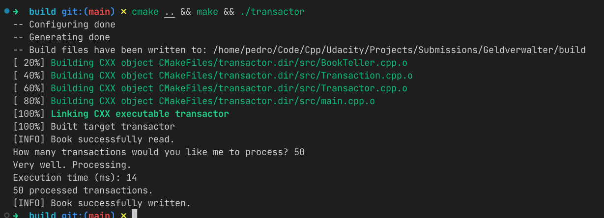

# Transaction Processing Simulator

The TPS (Transaction Processing Simulator) was created during the [Udacity's C++ Nanodegree Program](https://www.udacity.com/course/c-plus-plus-nanodegree--nd213) as the Capstone project. The purpose of this project is to simulate the processing of a series of transactions.



Example output of the main.cpp file

## Project Overview

### Goals

* Implement a program with the knowledge from the whole C++ Nanodegree
* Satisfy at least 5 criteria from the rubric.

### Structure

The project is divided into different files.

* `src/BookTeller.cpp` (and header file): Class for external file manipulation.
* `src/Transaction.cpp` (and header file): Class for a transaction object.
* `src/Transactor.cpp` (and header file): Class for the TPS (Transactor) and auxiliary classes (MessageQueue, WaitingTransactions)
* `src/main.cpp` (and header file): Example program execution.

### Dependencies

This project uses C++17 syntax.

* cmake >= 3.11.3
* make >= 4.1 (Linux, Mac), 3.81 (Windows)
* gcc/g++ >= 5.4

### Basic Build and Run Instructions

1. Clone this repository.
2. Install dependencies.
3. Make a build directory in the top level directory: `mkdir build && cd build`
4. Compile: `cmake .. && make`
5. Run it: `./transactor`

## Rubric Point Documentation

This section addresses the completion of [rubric points](https://review.udacity.com/#!/rubrics/2533/view)  Udacity's rubric.

**1. The project demonstrates an understanding of C++ functions and control structures.**

There is usage of different control structures e.g. IF-Statement (`Transactor.cpp` lines 137-143), WHILE-Loops (`BookTeller.cpp` lines 25-28). Due to object orientated programming adopted in this project, the code is naturally divided into functions.

**2. The project reads data from a file and process the data, or the program writes data to a file.**

The Book Teller loads the database of assets from a file `database/assets`. This can be found in `BookTeller.cpp` lines 9-32. A writing operation is also defined for saving the processed transactions to disk.

**3. The project uses Object Oriented Programming techniques.**

The TPS consists of multiple classes e.g. MessageQueue, Transactor ( `Transactor.cpp`), BookTeller (`BookTeller.cpp`), etc.

**4. Classes use appropriate access specifiers for class members.**

An example can be found in the `Transaction.h` file:

```c++
class Transaction
{
public:
    Transaction() = default;
    Transaction(std::string sender, std::string recipient, float amount);
    ~Transaction();
    std::string getSender();
    std::string getRecipient();
    float getAmount();

private:
    float _amount;
    std::string _sender;
    std::string _recipient;
};
```

**5. Class constructors utilize member initialization lists.**

Initialization lists are used in multiple files, for example in `Transaction.cpp`:

```c++
Transaction::Transaction(std::string sender, std::string recipient, float amount)
    : _sender(sender), _recipient(recipient), _amount(amount) {}
```

**6. The project uses multithreading. / A promise and future is used in the project. / A mutex or lock is used in the project. / A condition variable is used in the project.**

To increase performance, each request for processing a transaction is performed in it's own thread. A message queue is used for transmitting a message signalling program termination. The queue of awaiting transactions uses futures when adding new transactions, granting the correct order of processing.

```c++
std::future<void> Transactor::receiveTransaction(std::shared_ptr<Transaction> t)
{
    std::promise<void> prmsTransactionReceived;
    std::future<void> ftrTransactionReceived = prmsTransactionReceived.get_future();
    auto f = std::async(std::launch::async,
                        &WaitingTransactions::pushBack,
                        &this->_waitingTransactions,
                        t, std::move(prmsTransactionReceived));
    return ftrTransactionReceived;
}
```

Besides that the message queue uses a condition variable to synchronize receive and send and prevent useless receive requests.

```c++
/// @brief Receive new message.
/// @tparam T message
/// @return new message
template <typename T>
T MessageQueue<T>::receive()
{
    // lock access
    std::unique_lock<std::mutex> lock(this->_mutex);

    // wait for new messages
    this->_condition.wait(lock, [this]
                          { return !this->_queue.empty(); });

    // pull message from the queue
    auto message = std::move(this->_queue.back());

    // clear queue
    this->_queue.pop_back();

    // return new message
    return message;
}

/// @brief Send new message.
/// @tparam T message
/// @param message message to be sent
template <typename T>
void MessageQueue<T>::send(T &&message)
{
    // create a lock guard to the resource
    std::lock_guard<std::mutex> lock(this->_mutex);

    // push message into the queue
    this->_queue.push_back(std::move(message));

    // notify new message to the condition variable
    this->_condition.notify_one();
}
```

Mutexes are used to protect the transactions queue and message queue operations, preventing mixed console outputs and data races.
